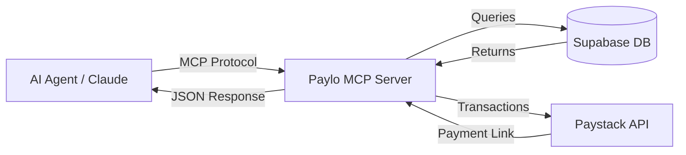

# Paylo MCP Server
### The Commerce Gateway for AI Agents

The **Paylo MCP Server** is a bridge that empowers AI models (like Claude, GPT-4) to interact with the real-world commerce ecosystem of Paylo. 

By adding this server to your AI agent's context, you transform it from a text processor into a **capable shopping assistant** that can browse storefronts, find products, and facilitate transactions across the Paylo network.

---

## 🚀 Capabilities

This server exposes a set of structured tools that allow AI agents to perform the following actions autonomously:

### 🛍️ Discovery & Search
- **Merchant Discovery:** Find active storefronts based on categories or names.
- **Product Search:** Semantic and keyword search across the entire Paylo product catalog.
- **Product Details:** Retrieve rich metadata, pricing, and availability for specific items.

### 💳 Commerce & Transactions
- **Cart Management:** intelligently build orders with multiple items.
- **Checkout:** Generate secure **Paystack** payment links for users to complete purchases.
- **Order Tracking:** Check the real-time status of payments and orders.

---

## 🏗️ Architecture

This server implements the **Model Context Protocol (MCP)** to standardize how AI agents interface with Paylo's infrastructure.



## 🛠️ Integration

### Quick Start for Claude Desktop

To give your local Claude Desktop app access to Paylo:

1. **Clone and Build**
   ```bash
   git clone https://github.com/nodeshift-nigeria/paylo-mcp-server.git
   cd paylo-mcp-server
   npm install
   npm run build
   ```

2. **Add to Claude Config**
   Edit your `claude_desktop_config.json`:
   ```json
   {
     "mcpServers": {
       "paylo": {
         "command": "node",
         "args": ["/absolute/path/to/paylo-mcp-server/build/index.js"]
       }
     }
   }
   ```

### 🐳 Docker Quick Start

You can also run the server directly from the published Docker image without installing Node.js:

```bash
docker run -i --rm ghcr.io/nodeshift-nigeria/paylo-mcp-server:latest
```

Add to `claude_desktop_config.json`:
```json
{
  "mcpServers": {
    "paylo": {
      "command": "docker",
      "args": [
        "run",
        "-i",
        "--rm",
        "ghcr.io/nodeshift-nigeria/paylo-mcp-server:latest"
      ]
    }
  }
}
```

## 📦 Available Tools

When integrated, the following tools become available to the AI:

| Tool Name | Description |
|-----------|-------------|
| `list_merchants` | Lists available Paylo storefronts with metadata. |
| `search_products` | Searches for products across all merchants or within a specific store. |
| `get_product_details` | Gets full details (price, description, stock) for a product. |
| `create_order` | Creates a pending order for a list of items. |
| `generate_payment_link` | Generates a checkout URL for a specific order. |
| `check_payment_status` | Verifies if an order has been paid. |

## 🔒 Security & Privacy

- **Read-Only Access:** The server primarily performs read operations on the product catalog.
- **Secure Payments:** No payment information is processed by the AI. The AI only generates a secure link; the user completes the payment on Paystack's hosted checkout.
- **Sandboxed:** The server runs locally or in your controlled environment, ensuring data privacy.

## 📄 License

This project is licensed under the MIT License - see the [LICENSE](LICENSE) file for details.

---
*Built by NodeShift Nigeria for the Paylo Ecosystem.*
