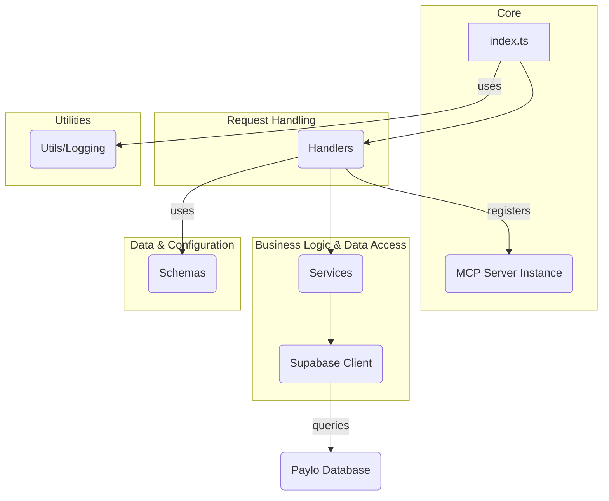

# System Patterns: Paylo MCP Server

## 1. Architecture Overview

The server follows a modular structure, separating concerns into distinct directories:

## 2. Key Technical Decisions

- **MCP SDK:** Uses `@modelcontextprotocol/sdk` for core server implementation and communication.
- **Stdio Transport:** Leverages `StdioServerTransport` for communication.
- **Modular Handlers:** Request handling logic is separated into `handlers/resources.ts` and `handlers/tools.ts`.
- **Service Layer:** Business logic is encapsulated in `services/` (e.g., `merchants.ts`, `products.ts`), which interact with Supabase.
- **Supabase Integration:** Uses the Supabase JS client for all database operations.
- **Schema Definitions:** Input validation uses `zod` schemas defined inline or in `schemas/`.
